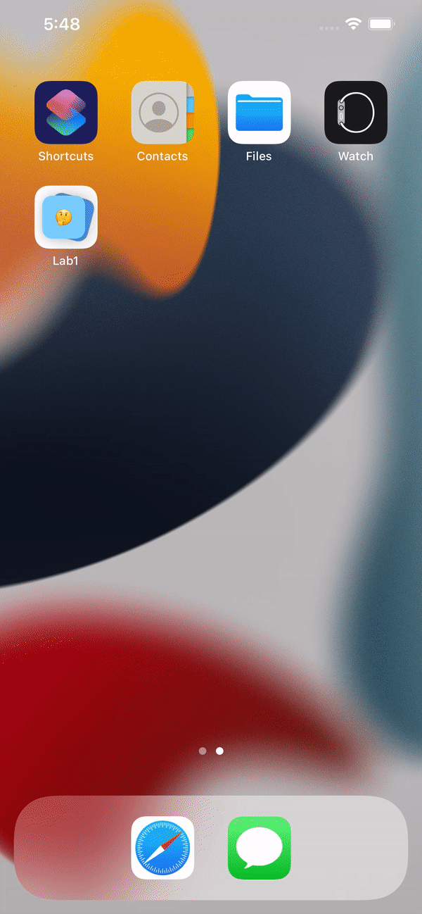

📝 `NOTE` Paste this template at the top of your existing `README.md` file from the last lab.

## Lab 4

### App Description
`TODO://` Add app description

### App Walk-though
`TODO://` Add the URL to your animated app walk-though `gif` in the image tag below. Make sure the gif actually renders and animates when viewing this README. (☝️ Remove this paragraph after after adding gif)

 

`TODO://` In the User stories section below, add an `x` between the `-[ ]` like this `- [x]` for any user story you complete. (☝️ Remove this paragraph after after checking off user stories)

## Required
- [x] User should see the app icon 
- [x] User should see a splash screen
- [x] User should see an flip animation when revealing the answer
- [x] User should see a slide animation when going to the next flashcard
- [x] User should see a slide animation when going to the previous flashcard
- [x] Push code to GitHub
## Optional
- [ ] User should see a nicer flaschard with rounded corners, shadows, and animating when showing the first time
- [ ] User should see all views properly layout when using the app on a phone of different sizes
- [ ] Correct answer in multiple choice should be random